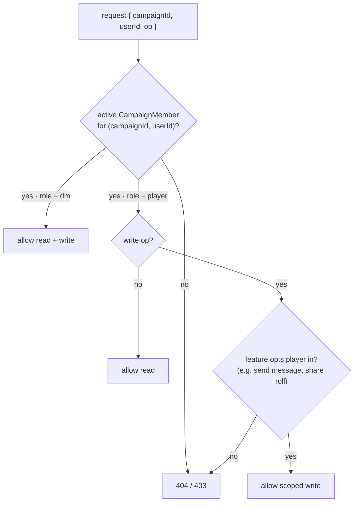

# Phase 1 — Identity & membership foundations

**Goal:** Give users a unique, searchable handle and give campaigns a membership
layer (owner = DM, plus invited players), then make campaign access member-aware.
This is the spine the rest of the initiative builds on.

**Depends on:** nothing.

## Deliverables (sub-issues)

### 1a. Add `username` to the User model
- Add `username?: string` to `User` in `lib/types.ts`.
- Add a **sparse unique index** on `users.username` in `lib/db.ts` (mirror the
  existing unique `email` index).
- Backfill migration script (`scripts/`) to assign usernames to existing accounts
  (e.g. derived from email local-part, de-duplicated). Idempotent.
- **Acceptance:** existing users keep working; index rejects duplicates; backfill
  is safe to re-run.

### 1b. Username validation + set/edit
- Validation rules in `lib/validation/` (length, allowed charset, reserved words,
  case-insensitive uniqueness).
- Allow setting a username at registration and editing it on a profile/account
  screen. `PATCH /api/auth/me` (or equivalent) to update.
- **Acceptance:** invalid/duplicate usernames rejected with clear errors; a user
  can set and change their handle.

### 1c. User search endpoint
- `GET /api/users/search?q=` returning minimal public profiles (`{ id, username }`)
  for member-add. Backed by `fuse.js` (already a dependency) or a prefix query.
- Rate-limited (reuse `lib/rate-limit.ts`); never leaks email/password fields;
  intended for use inside the invite flow.
- **Depends on:** 1a.
- **Acceptance:** searching a partial username returns matching handles only;
  no PII leakage; rate limit enforced.

### 1d. `campaignMembers` collection + storage
- Add `CampaignMember` type; create `campaignMembers` collection with a unique
  `{campaignId, userId}` index.
- `storage` methods: add member, update status/role, list members for a campaign,
  list campaigns for a member.
- On campaign creation, seed an `active` `dm` membership for the owner.
- **Acceptance:** the owner is always an active DM member; duplicate memberships
  rejected; storage methods covered by unit/integration tests.

### 1e. Member-aware campaign access (refactor)
- Add `assertCampaignAccess(campaignId, userId)` to `lib/utils/campaign.ts`
  returning the caller's role (`dm` | `player`) or denying access.
- Refactor campaign read routes (`app/api/campaigns/[id]/**`) from `{ userId, id }`
  to use the helper, so active members can read campaigns they don't own. Write
  operations remain DM-only unless a feature specifies otherwise.
- **Depends on:** 1d.
- **Acceptance:** a player member can GET a campaign; a non-member gets 404/403;
  mutations stay DM-gated; existing owner behavior unchanged.

The access check every campaign-scoped route funnels through (today's
`{ userId, id }` owner check is the leftmost path only):

