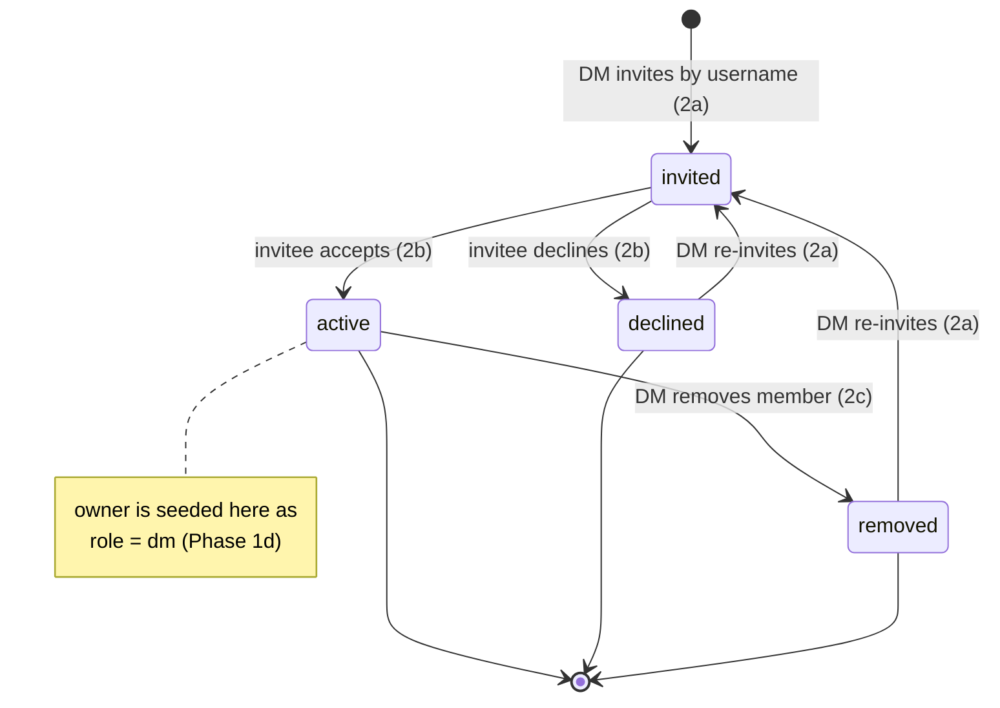

# Phase 2 — Invite & accept flow ✅ COMPLETE

**Goal:** Let a DM find users by username and invite them; let invited users accept
or decline. Membership only becomes `active` on acceptance.

**Depends on:** Phase 1 (1c search, 1d members, 1e access). ✅ Phase 1 complete.

> **Tracking:** epic [#294](https://github.com/dougis-org/session-combat/issues/294) — CLOSED ✅
> **Status:** All 4 sub-issues CLOSED ✅ — Phase 2 complete.

## Membership lifecycle

A `CampaignMember.status` moves through these states. The owner is seeded directly
as `active` with role `dm` (Phase 1d) and never goes through the invite flow.



## Invite → accept sequence

```mermaid
sequenceDiagram
    autonumber
    participant DM
    participant Search as GET /users/search (1c)
    participant Inv as POST /campaigns/:id/members (2a)
    participant DB as MongoDB
    participant P as Player
    participant Inbox as GET /me/invitations (2b)

    DM->>Search: q="ali"
    Search-->>DM: [{ id, username }]
    DM->>Inv: invite { userId }
    Inv->>Inv: assert caller is DM; no dup / self
    Inv->>DB: insert member { status: invited }
    P->>Inbox: list my pending invites
    Inbox-->>P: [{ campaign, invitedBy }]
    P->>Inv: respond { accept } (2b)
    Inv->>DB: status = active, respondedAt
    Note over P: campaign now appears<br/>in the player's list
```

## Deliverables (sub-issues)

### ✅ 2a. Invite API · [#305](https://github.com/dougis-org/session-combat/issues/305) — CLOSED
- `POST /api/campaigns/[id]/members` — DM-only — creates a `CampaignMember` with
  status `invited` for a given `userId` (resolved from username search).
- Guards: caller must be the campaign DM; cannot invite an existing
  active/invited member; cannot invite self.
- **Re-invite (upsert, not insert):** because `{campaignId, userId}` is unique (1d),
  the invite must **upsert**. If a prior membership exists in `declined` or
  `removed`, transition it back to `invited` (reset `invitedBy`/`invitedAt`, clear
  `respondedAt`) instead of `insertOne`, which would hit the unique index. Only
  existing `active`/`invited` members are rejected. (This is the
  `declined → invited` / `removed → invited` path in the lifecycle diagram above.)
- **Depends on:** 1c, 1d, 1e.
- **Acceptance:** DM can invite a user by username; re-inviting a previously
  declined/removed user succeeds and resets status to `invited`; active/invited
  duplicates and self-invites rejected; non-DM cannot invite.

### ✅ 2b. Accept / decline API + invitations inbox · [#306](https://github.com/dougis-org/session-combat/issues/306) — CLOSED
- `POST /api/campaigns/[id]/members/respond` (or `PATCH .../members/me`) for the
  invited user to set status `active` or `declined`; stamps `respondedAt`.
- `GET /api/me/invitations` listing the caller's pending invites.
- **Depends on:** 1d.
- **Acceptance:** invited user can accept (→ active member) or decline; inbox lists
  only the caller's pending invites; others cannot respond on their behalf.

### ✅ 2c. Campaign member-management UI · [#307](https://github.com/dougis-org/session-combat/issues/307) — CLOSED
- On the campaign page: member list with roles/status, a username search box, and
  an invite action; pending-invite badges; DM can remove a member
  (status `removed`).
- **Depends on:** 2a.
- **Acceptance:** DM can search, invite, see pending/active members, and remove a
  member; follows existing `lib/components` + Tailwind semantic-token conventions.

### ✅ 2d. Player invitations inbox UI · [#308](https://github.com/dougis-org/session-combat/issues/308) — CLOSED
- A surface (nav badge + page/panel) where a player sees pending campaign invites
  and accepts/declines.
- **Depends on:** 2b.
- **Acceptance:** player sees invites, can accept/decline, and the campaign appears
  in their campaign list once accepted.
