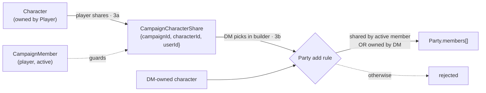

# Phase 3 — Cross-user characters into parties (partially complete)

**Goal:** Let players opt their own characters into a campaign, and let the DM pull
those shared characters into the parties they build — even though the DM doesn't
own them.

**Depends on:** Phase 1 (1e access). ✅ Phase 1 complete. Benefits from Phase 2 (active members exist),
but the data layer can be built against memberships directly.

> **Tracking:** epic [#295](https://github.com/dougis-org/session-combat/issues/295) — OPEN
> **Status:** 1 of 2 sub-issues closed (3a delivered). **3b (#310) open — next to work on.**

## How a player's character reaches a DM's party

The character record stays owned by the player; the DM only references it once the
player has shared it and the DM-side party rule confirms the share.

## Deliverables (sub-issues)

### ✅ 3a. Character sharing (opt-in) — data + player UI · [#309](https://github.com/dougis-org/session-combat/issues/309) — CLOSED
- Add `CampaignCharacterShare` type; create `campaignCharacterShares` collection
  with unique `{campaignId, characterId}`.
- API for a player to share/unshare one of **their** characters into a campaign
  they're an active member of, plus a list endpoint of characters a member has
  shared.
- Player UI: on the campaign (or character) view, choose which characters to share.
- **Depends on:** 1e.
- **Acceptance:** a player can share/unshare only their own characters into
  campaigns they belong to; sharing a character they don't own is rejected.

### 🟡 3b. Party builder uses shared characters · [#310](https://github.com/dougis-org/session-combat/issues/310) — OPEN
- Update the party access rule: the DM may add a `characterId` to a party in a
  campaign if that character is shared into the campaign by an active member (in
  addition to characters the DM owns).
- Party builder UI: surface shared members' characters as selectable, grouped by
  owner; respect soft-delete (`characters_active`).
- **Cleanup on unshare / member removal (proactive + reactive):** prefer
  **proactive** cleanup — when a character is unshared or a member is removed, set
  `leftAt` on the affected `Party.members[]` entries (reusing the existing leave
  semantics) so stale references aren't persisted. Keep a **reactive** guard in the
  party / campaign-context loader that filters any character no longer shared, as
  defense-in-depth.
- **Depends on:** 3a.
- **Acceptance:** DM can add a player's shared character to a campaign party;
  unsharing a character or removing a member proactively sets `leftAt` on its party
  entries and it stops appearing in party/campaign context; DM cannot add an
  unshared character.
