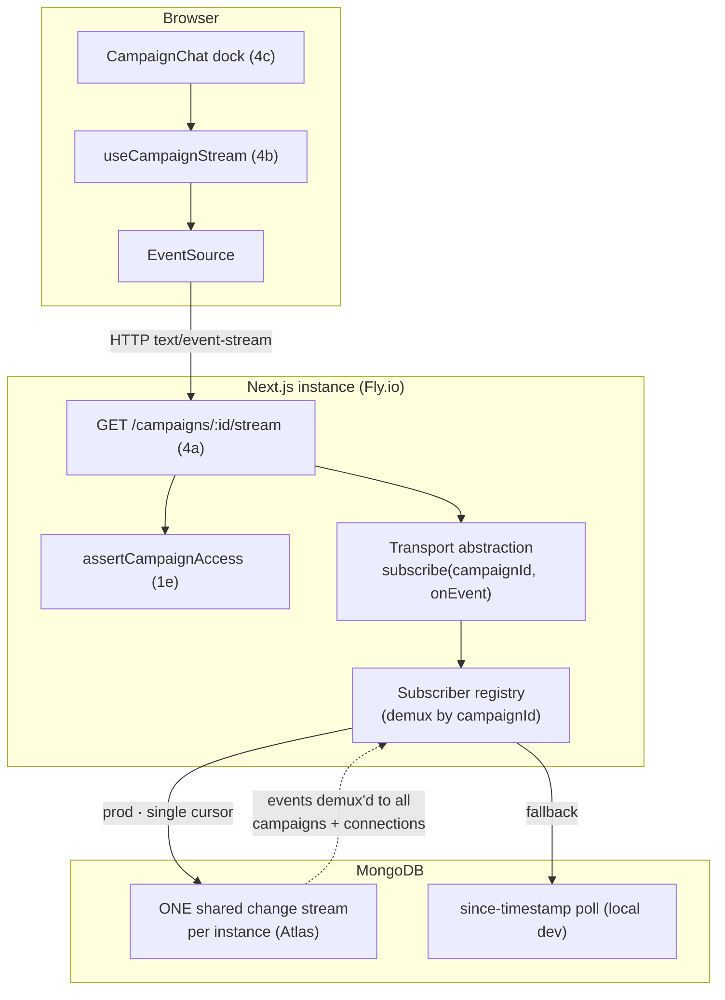
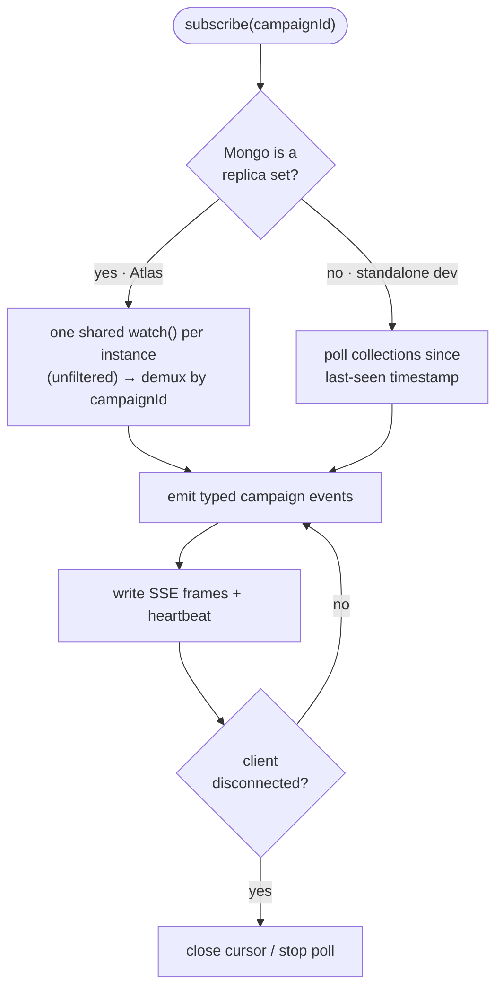

# Phase 4 — Real-time transport

**Goal:** Stand up the real-time pipe — a per-campaign SSE stream backed by MongoDB
Change Streams (prod/Atlas) with a polling fallback (local dev) — plus the client
hook and the collapsible chat dock shell. **No product features yet**, just the
plumbing everything else plugs into.

**Depends on:** Phase 1 (1e access). ✅ Phase 1 complete. Items 4a/4b/4c can largely proceed in parallel.

> **Tracking:** epic [#296](https://github.com/dougis-org/session-combat/issues/296) — OPEN
> **Status:** Not started. 4b and 4c have no upstream dependencies beyond Phase 1 and can begin immediately.

## Component layout

## Transport selection (4a)

The same `subscribe()` interface picks its source at runtime so clients never change:

## Deliverables (sub-issues)

### 🟡 4a. SSE stream endpoint + transport abstraction · [#311](https://github.com/dougis-org/session-combat/issues/311) — OPEN
- `GET /api/campaigns/[id]/stream` returning a `text/event-stream` `ReadableStream`;
  caller must pass `assertCampaignAccess`.
- Transport abstraction in `lib/server/` (or `lib/api/`): a `subscribe(campaignId,
  onEvent)` that uses **MongoDB Change Streams** when available (Atlas) and a
  **`since`-timestamp DB poll** otherwise. Emits typed events scoped to the campaign.
- **One shared change stream per process (multiplex across campaigns *and*
  connections):** each server instance opens a **single** change stream over the
  relevant collections — **not** filtered by campaign — and demultiplexes events to
  per-campaign subscriber sets in-process via a registry keyed by `campaignId`.
  Never one cursor per connection *or* per campaign; both scale with load and
  exhaust Atlas connection / change-stream limits. Keep the count of streams to
  Mongo as low as possible (ideally one per instance). The shared stream opens lazily
  on the first SSE connection and closes when the instance's last connection drops.
- Heartbeat/keepalive comments; clean teardown on disconnect; respects Fly's
  request lifecycle.
- **Depends on:** 1e.
- **Acceptance:** an authorized member receives events for their campaign and
  nothing for campaigns they're not in; connections across **multiple** campaigns on
  one instance share a **single** change stream (verified by cursor count); works
  against Atlas (change streams) and a standalone Mongo (polling); connections close
  cleanly and the shared stream closes when the instance's last connection drops.

### 🟡 4b. Client `useCampaignStream` hook · [#312](https://github.com/dougis-org/session-combat/issues/312) — OPEN
- React hook in `lib/hooks/` wrapping `EventSource` with auto-reconnect/backoff,
  connection state, and typed event dispatch.
- **Acceptance:** components can subscribe to a campaign and receive typed events;
  reconnects after transient drops; tears down on unmount.

### 🟡 4c. Collapsible / pinnable chat dock shell · [#313](https://github.com/dougis-org/session-combat/issues/313) — OPEN
- `CampaignChat` component in `lib/components/`: fixed dock that toggles
  collapsed pill ↔ expanded drawer, with a **pin-open** control persisted to
  `localStorage`. No data wiring yet — layout, states, and a11y only.
- Follows Tailwind semantic tokens (`--color-party`, etc.) and existing component
  patterns.
- **Acceptance:** dock collapses/expands, pin state survives reload, doesn't
  obstruct the page when collapsed, keyboard-accessible.
