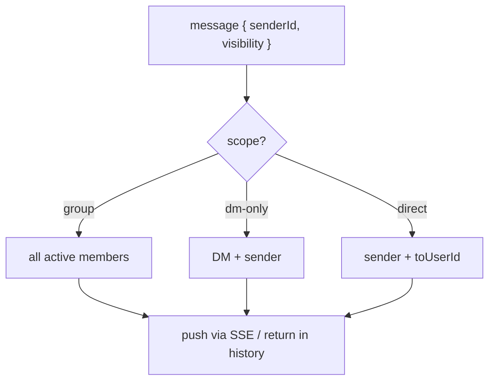

# Phase 5 — Messaging

**Goal:** Persistent, campaign-scoped messaging with group / direct / DM-only
visibility, delivered live over the Phase 4 stream and rendered in the chat dock.

**Depends on:** Phase 1 (1e), Phase 4 (4a/4b transport + 4c dock).

> **Tracking:** epic [#297](https://github.com/dougis-org/session-combat/issues/297).

## Visibility model

Server-side, every message carries a `visibility.scope`. The stream filter decides
who a stored message is pushed to (and `GET` history applies the same predicate):

> The same `{ scope, toUserId? }` envelope is reused by shared rolls (Phase 6),
> so a new scope added here is automatically available to rolls.

## Deliverables (sub-issues)

### 5a. `campaignMessages` collection + API · [#314](https://github.com/dougis-org/session-combat/issues/314)
- Add `CampaignMessage` type; create collection with index `{campaignId, createdAt}`.
- `POST /api/campaigns/[id]/messages` — send a `text` message with a `visibility`
  (`group` | `direct`+`toUserId` | `dm-only`); `GET` for paginated history filtered
  by what the caller is allowed to see.
- Visibility enforcement server-side: `dm-only` reaches only the DM + sender;
  `direct` reaches only sender + recipient; `group` reaches all active members.
- **Depends on:** 1e.
- **Acceptance:** messages persist; history pagination works; a player cannot read
  a direct/dm-only message not addressed to them; writes emit a stream event.

### 5b. Wire chat dock to stream + send · [#315](https://github.com/dougis-org/session-combat/issues/315)
- Connect `CampaignChat` to `useCampaignStream` for live message events and to the
  send API; composer includes a **visibility selector** (Group / DM / whisper to a
  member).
- Render the message feed with sender handle, timestamp, and a visibility marker;
  unread indicator when collapsed.
- **Depends on:** 4b, 4c, 5a.
- **Acceptance:** a member sends a group/direct/DM message and connected members
  see it live; history loads on open; whisper targets resolve by username;
  visibility markers are clear.
