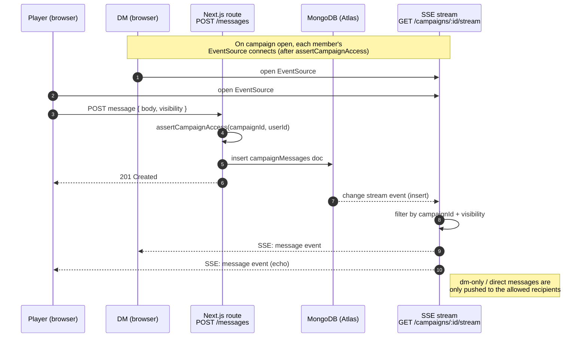
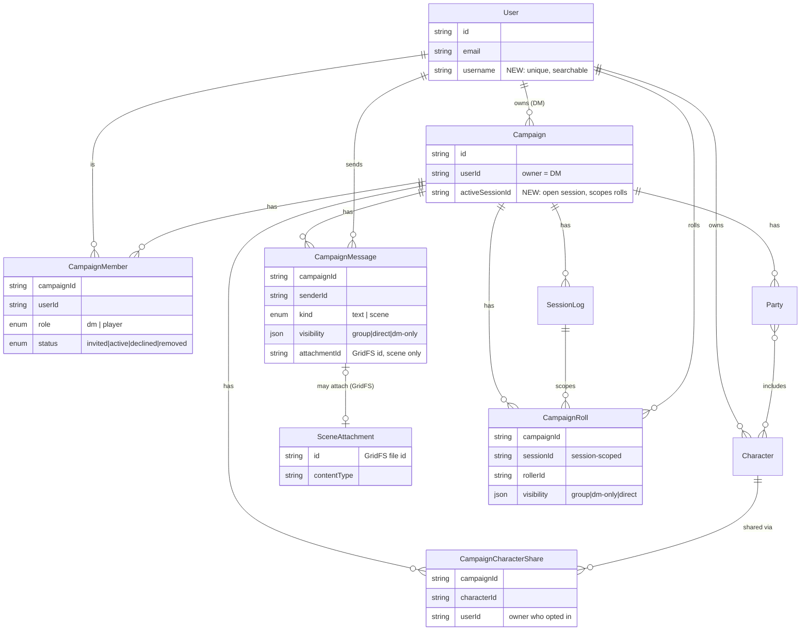
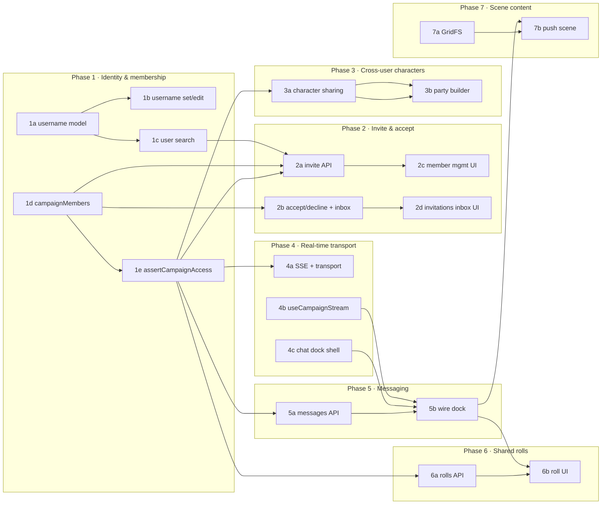
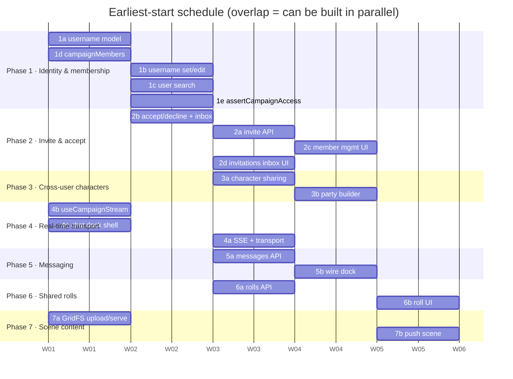

# Multi-User Campaigns

> Status: **Planning** · Owner: DM (campaign owner) · Last updated: 2026-05-31

This initiative turns campaigns from a single-owner artifact into a shared space
where a DM (the campaign owner) invites a group of players who participate during
sessions. It is intentionally built foundations-first as small, independently
deliverable pieces so work can proceed in parallel and the design can keep growing
over time.

## Goals

The group of users attached to a campaign serves these purposes:

1. **Parties from real players** — the DM can pull players' characters into the
   parties they build.
2. **Scene-setting** — the DM can push information to the group during a session
   (maps, images, text) to set the scene.
3. **Shared rolls** — players can share dice rolls (and similar) with either the
   DM directly or the whole group (e.g. a saving throw that only the DM sees).
4. **Group & direct messaging** — members can message each other or the entire
   group.
5. **Always-available chat UI** — a collapsible messaging panel that can be pinned
   open, so it doesn't permanently consume screen space.

This is **not** a complete requirements set. The data model and APIs are designed
to expand (new message kinds, new visibility scopes, new shared item types) without
reshaping the foundations.

## Architecture decisions

| Area | Decision | Rationale |
|------|----------|-----------|
| Real-time transport | **Server-Sent Events (SSE)** from a per-campaign stream endpoint; client→server stays plain `POST` | Next.js App Router supports streaming responses with no custom server; broadcast-shaped feature set; works behind Fly's HTTPS proxy; zero new infra/cost |
| Real-time backplane | **MongoDB Change Streams** with a **DB-polling fallback** behind a transport abstraction | We already run MongoDB; change streams cost nothing and work across machines. Polling fallback keeps standalone/dev Mongo and non-replica-set deploys working |
| Fly scale-to-zero | No special handling | Open SSE connections keep the machine warm during a session; idle = nobody connected = nothing to deliver |
| Scene/image storage | **MongoDB GridFS** | No binary store exists today; GridFS needs no S3/bucket, survives Fly's ephemeral disk, stays zero-cost |
| Membership | **Invite + accept**; players own their own characters and **opt them in** per campaign | Consent-based; players maintain their own sheets |
| Owner role | The existing `campaign.userId` owner is treated as the **DM** | No migration of ownership; layer membership on top |
| Message persistence | **Persistent, campaign-scoped** (scene content/images are messages, so also campaign-scoped) | History / recap; scene assets stay available across sessions |
| Roll persistence | **Session-scoped** (tied to existing `sessionLogs`) | Rolls belong to the session they happened in |

## Resolved decisions

- **Production MongoDB is Atlas** (a replica set), so **Change Streams are
  available at no extra cost** — the SSE backplane uses them directly in prod. The
  DB-polling fallback is retained only for standalone/local-dev Mongo (which is not
  a replica set), kept behind the Phase 4 transport abstraction so it stays a config
  detail.

## Real-time data flow

How a live update reaches members, end to end. Client→server is a normal `POST`;
server→clients is the SSE push driven by the MongoDB change stream (Atlas) or the
polling fallback (local dev).

> Local dev (standalone Mongo, no replica set) swaps the change-stream feed for a
> `since`-timestamp DB poll behind the same transport interface — clients are
> unaffected. See [Phase 4](./04-realtime-transport.md).

## Data model (target shapes)

New/changed types in `lib/types.ts` and new MongoDB collections (indexes follow the
existing `lib/db.ts` pattern):

- `User.username?: string` — unique, searchable handle (sparse unique index; backfilled).
- `CampaignMember` — `{ campaignId, userId, role: 'dm'|'player', status: 'invited'|'active'|'declined'|'removed', invitedBy, invitedAt, respondedAt? }`. Unique `{campaignId,userId}`.
- `CampaignCharacterShare` — `{ campaignId, userId, characterId, sharedAt }`. Unique `{campaignId,characterId}`. Player opt-in of a character into a campaign.
- `CampaignMessage` — `{ campaignId, senderId, kind: 'text'|'scene', visibility: {scope:'group'|'direct'|'dm-only', toUserId?}, body?, attachmentId? }`. Index `{campaignId,createdAt}`. Persistent.
- `CampaignRoll` — `{ campaignId, sessionId, rollerId, label?, formula, rolls[], total, visibility: {scope:'group'|'dm-only'|'direct', toUserId?} }`. Index `{campaignId,sessionId,createdAt}`. Session-scoped.
- `Campaign.activeSessionId?: string` — **NEW**: the session currently open for live play (set when the DM starts a session, cleared when it ends). Phase 6 rolls are scoped to it; with no active session, roll submission is rejected rather than silently dropped.

The relationships between the existing entities (grey-ish: `User`, `Campaign`,
`Character`, `Party`, `SessionLog`) and the new ones introduced by this initiative:

## Access-control change (the spine)

Campaign reads are currently `{ userId, id }` (single owner). This becomes
**"requester is the DM *or* an active member"** via a new
`assertCampaignAccess(campaignId, userId)` helper in `lib/utils/campaign.ts` that
returns the member's role. Party building gains a rule: the DM may add a
`characterId` to a party only if that character is shared into the campaign by an
active member. Phase 1e ([#304](https://github.com/dougis-org/session-combat/issues/304))
delivers this refactor; most later phases depend on it.

## Phase roadmap

Each phase is an epic (parent issue). Each deliverable is a sub-issue that can ship
on its own. `→` marks hard dependencies; everything else can run in parallel.

| Phase | Theme | Epic | Sub-issues | Depends on |
|-------|-------|------|------------|------------|
| 1 | Identity & membership foundations | [#293](https://github.com/dougis-org/session-combat/issues/293) | [1a #300](https://github.com/dougis-org/session-combat/issues/300) · [1b #301](https://github.com/dougis-org/session-combat/issues/301) · [1c #302](https://github.com/dougis-org/session-combat/issues/302) · [1d #303](https://github.com/dougis-org/session-combat/issues/303) · [1e #304](https://github.com/dougis-org/session-combat/issues/304) | — |
| 2 | Invite & accept flow | [#294](https://github.com/dougis-org/session-combat/issues/294) | [2a #305](https://github.com/dougis-org/session-combat/issues/305) · [2b #306](https://github.com/dougis-org/session-combat/issues/306) · [2c #307](https://github.com/dougis-org/session-combat/issues/307) · [2d #308](https://github.com/dougis-org/session-combat/issues/308) | Phase 1 |
| 3 | Cross-user characters into parties | [#295](https://github.com/dougis-org/session-combat/issues/295) | [3a #309](https://github.com/dougis-org/session-combat/issues/309) · [3b #310](https://github.com/dougis-org/session-combat/issues/310) | Phase 1 |
| 4 | Real-time transport | [#296](https://github.com/dougis-org/session-combat/issues/296) | [4a #311](https://github.com/dougis-org/session-combat/issues/311) · [4b #312](https://github.com/dougis-org/session-combat/issues/312) · [4c #313](https://github.com/dougis-org/session-combat/issues/313) | Phase 1 |
| 5 | Messaging | [#297](https://github.com/dougis-org/session-combat/issues/297) | [5a #314](https://github.com/dougis-org/session-combat/issues/314) · [5b #315](https://github.com/dougis-org/session-combat/issues/315) | Phase 4 |
| 6 | Shared dice rolls (session-scoped) | [#298](https://github.com/dougis-org/session-combat/issues/298) | [6a #316](https://github.com/dougis-org/session-combat/issues/316) · [6b #317](https://github.com/dougis-org/session-combat/issues/317) | Phase 5 |
| 7 | Scene content (maps/images) | [#299](https://github.com/dougis-org/session-combat/issues/299) | [7a #318](https://github.com/dougis-org/session-combat/issues/318) · [7b #319](https://github.com/dougis-org/session-combat/issues/319) | Phase 5 |

### Dependency graph

Arrows are hard dependencies (a node can't start until its predecessors merge).
Nodes with no inbound arrow at the same level can be built in parallel — e.g. the
Phase 1 identity track (1a→1b, 1a→1c) runs alongside the membership track
(1d→1e), and the Phase 4 dock shell (4c) and hook (4b) need nothing upstream.

### Build order & parallelism (waves)

The dependency graph above shows *what blocks what*; this view shows *when each
sub-issue can start* and *what runs concurrently*. A "wave" is the earliest point a
sub-issue can begin assuming unlimited parallel hands (each bar ≈ one deliverable;
bars in the same column run in parallel). Exact edges remain authoritative in the
dependency graph — the waves are the schedule those edges imply.

| Wave | Can start | Notes |
|------|-----------|-------|
| 1 | **1a, 1d, 4b, 4c, 7a** | All dependency-free — the UI shell (4c), stream hook (4b), and GridFS (7a) need nothing upstream, so they parallelize the Phase 1 foundations |
| 2 | **1b, 1c, 1e, 2b** | `1e` (access spine) unlocks most of the rest; `2b` only needs `1d` |
| 3 | **2a, 2d, 3a, 4a, 5a, 6a** | Widest fan-out — six independent tracks once `1e` lands |
| 4 | **2c, 3b, 5b** | `5b` is the integration point (needs `4b` + `4c` + `5a`) |
| 5 | **6b, 7b** | Feature UIs that sit on top of messaging (`5b`) |

See the per-phase docs for deliverables, acceptance criteria, and affected files:

- [Phase 1 — Identity & membership](./01-identity-and-membership.md)
- [Phase 2 — Invite & accept](./02-invite-and-accept.md)
- [Phase 3 — Cross-user characters](./03-cross-user-characters.md)
- [Phase 4 — Real-time transport](./04-realtime-transport.md)
- [Phase 5 — Messaging](./05-messaging.md)
- [Phase 6 — Shared dice rolls](./06-shared-rolls.md)
- [Phase 7 — Scene content](./07-scene-content.md)

## How we work

- This folder is the human-readable source of truth for approach and progress.
- GitHub issues track delivery: 7 phase epics, each with fine-grained sub-issues.
- An **OpenSpec change** (`openspec/changes/…`) is opened **per issue, as we pick it
  up**, following the existing proposal → tasks → specs convention.
